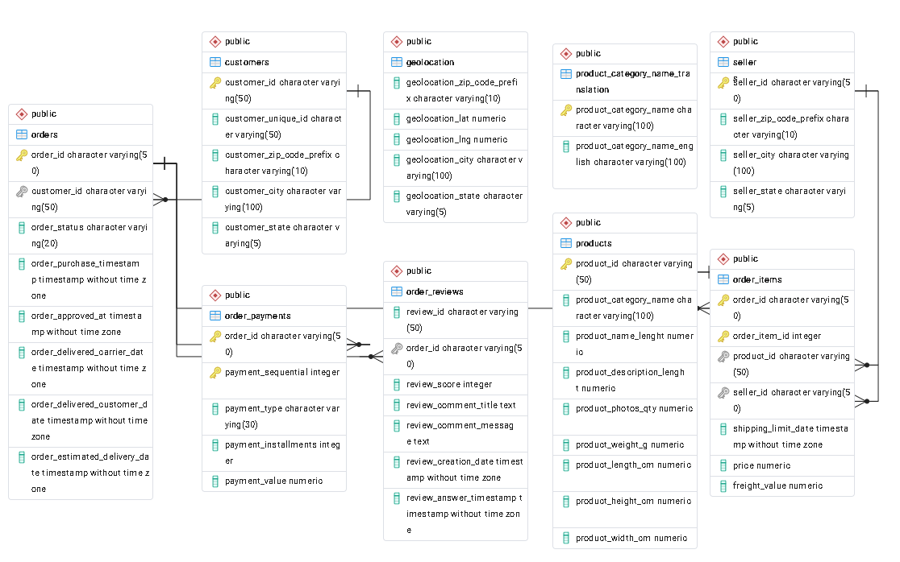
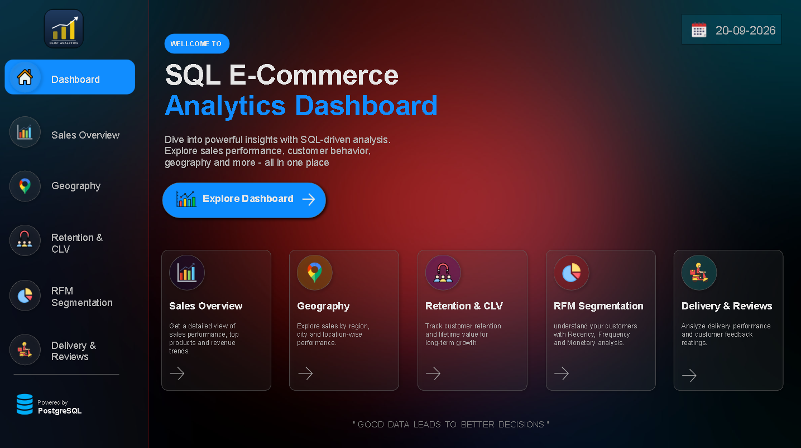
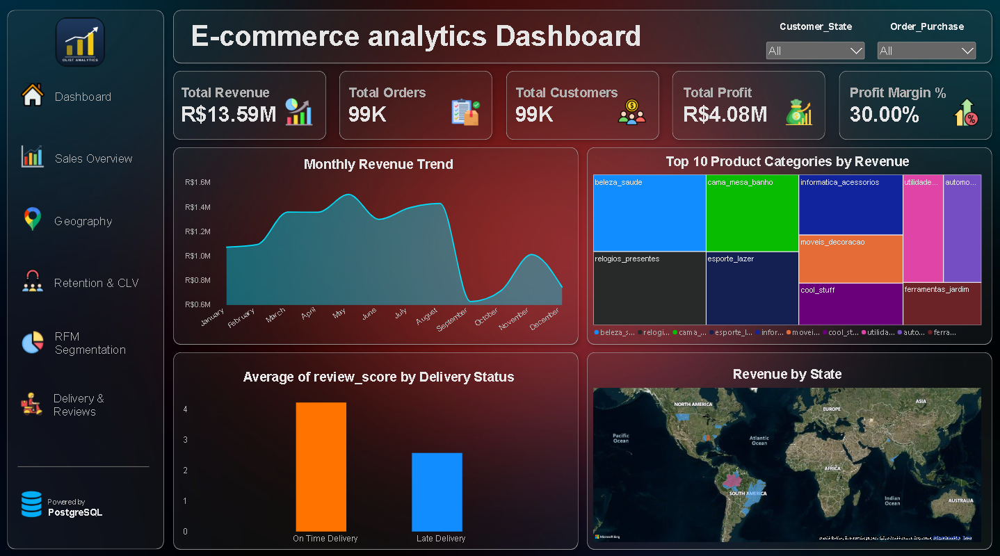
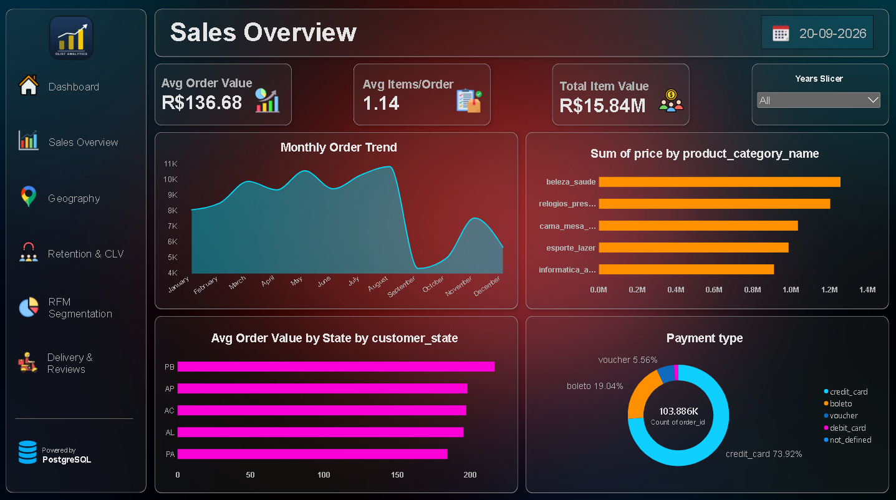
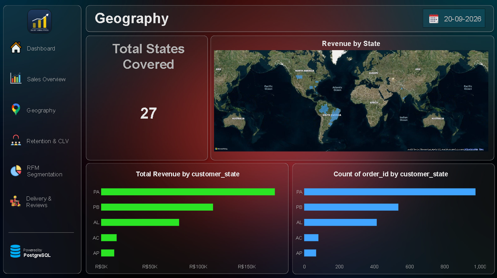
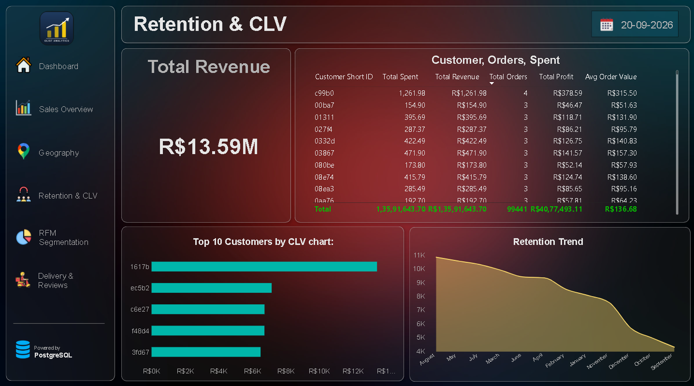
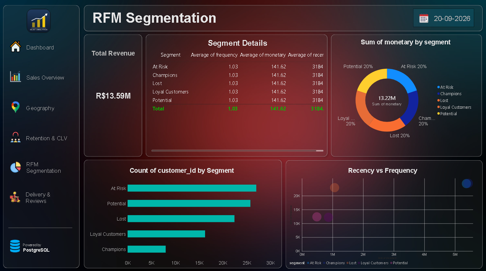
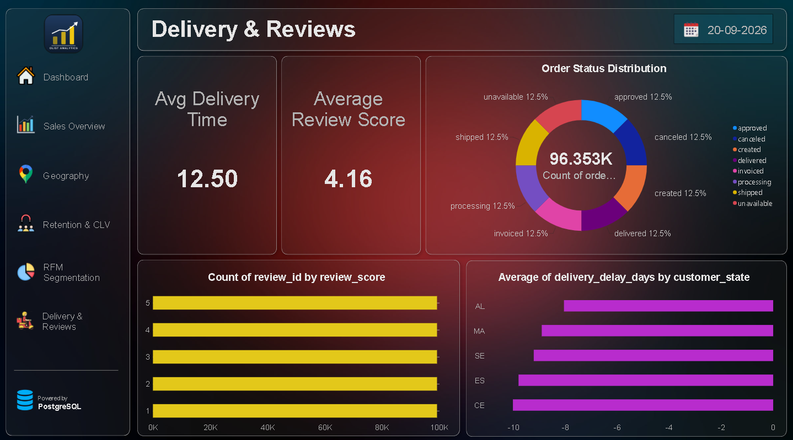

<div align="center">

# 🛒 E-Commerce Analytics
### SQL + Power BI Portfolio Project


*An end-to-end data analytics project simulating a Business Analyst role at an online marketplace — from raw data to interactive dashboards.*

</div>

---

## 📌 Overview

This project turns ~100K raw e-commerce transactions into actionable business insights. It covers the full analytics workflow:

> **Database Design → SQL Analysis → Query Optimization → Power BI Dashboard**

The goal: answer real business questions a marketplace analyst would face — revenue trends, customer segmentation, retention, and delivery performance.

---

## 🗂️ Dataset

**[Brazilian E-Commerce Public Dataset by Olist](https://www.kaggle.com/datasets/olistbr/brazilian-ecommerce)** (Kaggle)

| | |
|---|---|
| 📦 Orders | ~100,000 |
| 🗃️ Tables | 9 relational tables |
| 📊 Coverage | Customers, Orders, Items, Products, Sellers, Payments, Reviews, Geolocation |

---

## 🛠️ Tech Stack

| Layer | Tools / Techniques |
|---|---|
| **Database** | PostgreSQL |
| **SQL** | CTEs, Window Functions (`NTILE`, `RANK`), Subqueries, Multi-table JOINs |
| **Optimization** | `EXPLAIN ANALYZE`, Indexing |
| **Visualization** | Power BI — 7-page dashboard with custom navigation |

---

## 🗄️ Database Schema

9 normalized tables connected via foreign keys:
`customers → orders → order_items → products / sellers` (+ payments, reviews, geolocation)

<div align="center">



</div>

---

## 🔍 Business Questions & Key Insights

| # | Business Question | 💡 Key Insight |
|---|---|---|
| 1 | Monthly revenue trend? | Clear growth pattern with seasonal spikes |
| 2 | Top revenue-generating products? | `health_beauty` leads the category mix |
| 3 | Which states spend more per order? | PB (Paraíba) has the highest AOV — **R$216.67** |
| 4 | How to segment customers (RFM)? | Identified **Champions, Loyal, At Risk, Lost** segments |
| 5 | Do customers return after first purchase? | ⚠️ **Retention is weak** — most are one-time buyers |
| 6 | Who are the highest lifetime-value customers? | Top repeat customers drive disproportionate revenue |
| 7 | Does late delivery affect reviews? | 🔥 **On-time: 4.29★ vs Late: 2.57★** average rating |

---

## ⚡ Query Optimization

Added indexes on `orders.customer_id` and `order_items.order_id` to speed up frequent JOINs.

<div align="center">

| Before | After | Improvement |
|:---:|:---:|:---:|
| 864 ms | 742 ms | **~14% faster** ⚡ |

</div>

*(Insert before/after `EXPLAIN ANALYZE` screenshots here)*

---

## 📊 Power BI Dashboard

An interactive **7-page dashboard** with a vertical page-navigator sidebar for seamless switching.

| Page | What it shows |
|---|---|
| 🏠 **1. Home** | Landing page — project overview & navigation |
| 📈 **2. Dashboard** | KPI cards — Revenue, Orders, Customers, Profit, Margin % |
| 🛍️ **3. Sales Overview** | Revenue trend & top product categories |
| 🌎 **4. Geography** | Orders & revenue by state, AOV comparison |
| 🔁 **5. Retention & CLV** | Cohort retention & customer lifetime value |
| 🎯 **6. RFM Segmentation** | Champions, Loyal, At Risk, Lost segments |
| 🚚 **7. Delivery & Reviews** | Delivery delay impact on review scores |

### 🖼️ Screenshots

<div align="center">


<p><em>Home</em></p>


<p><em>Dashboard</em></p>


<p><em>Sales Overview</em></p>


<p><em>Geography</em></p>


<p><em>Retention & CLV</em></p>


<p><em>RFM Segmentation</em></p>


<p><em>Delivery & Reviews</em></p>

</div>

🎥 **Demo video:** *(add YouTube/Loom link here)*

---

## 📁 Repo Structure

```
├── ecommerce_analysis.sql       # Schema, indexes, all business queries
├── ecommerce_dashboard.pbix     # Power BI dashboard file
├── dashboard/                   # Dashboard page screenshots
├── er_diagram.png               # Database schema diagram
└── README.md                    # This file
```

---

## 🚀 How to Run

1. Download the Olist dataset from Kaggle
2. Create a PostgreSQL database
3. Run the schema section of `ecommerce_analysis.sql` to create tables
4. Import each CSV into its corresponding table
5. Run the queries in the same file to reproduce the analysis
6. Open `ecommerce_dashboard.pbix` in Power BI Desktop to explore the dashboard

---

## 👤 Author

*(Your name · LinkedIn · GitHub links here)*

<div align="center">

⭐ *If you found this project useful, consider giving it a star!*

</div>
